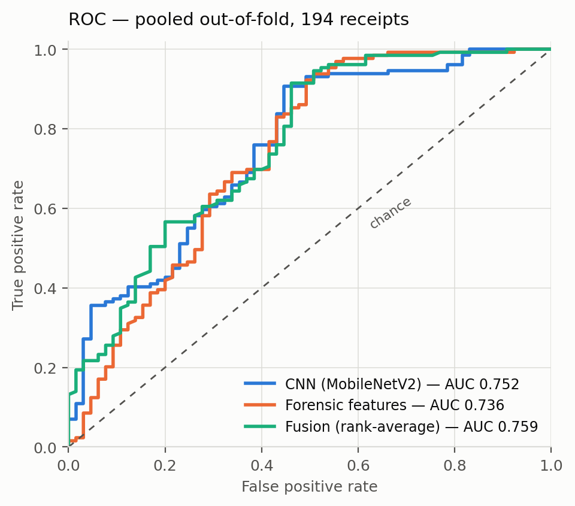
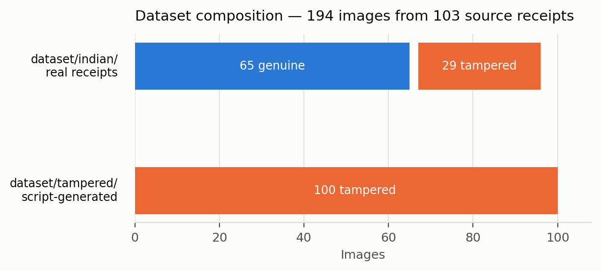
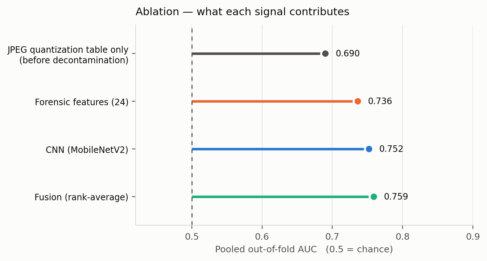
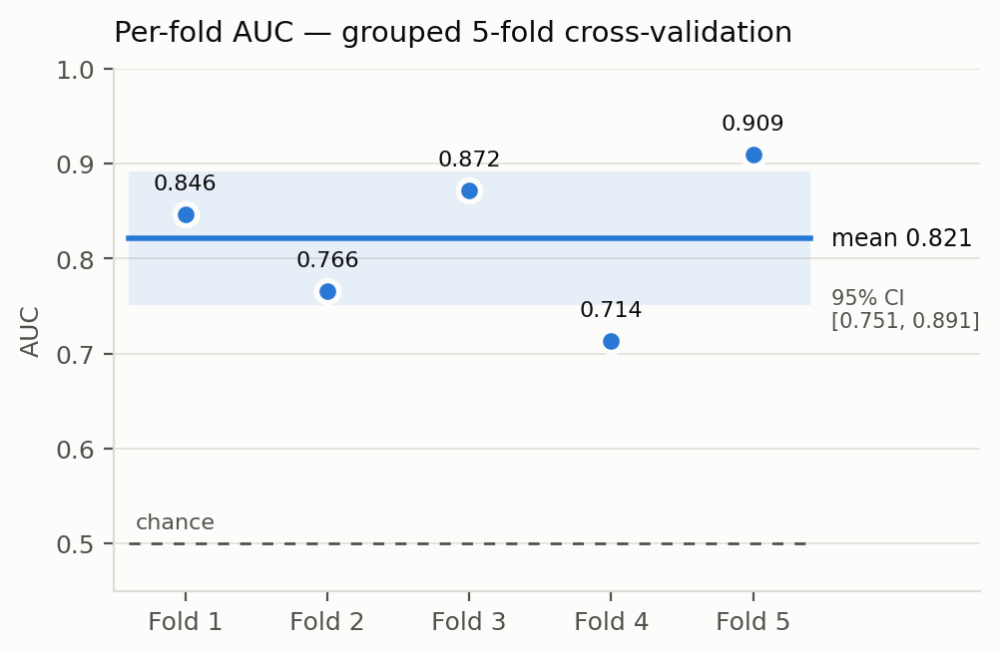
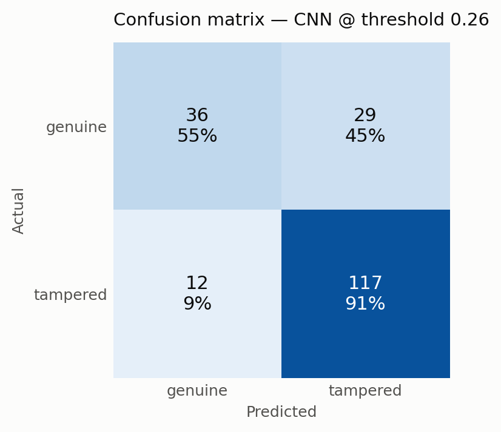

# Fraud Detection — Test Report (Sprint 3)

**Owners:** Ranjeet Singh (Sprint 2 CNN, dataset) · Ashfaaq KT (Sprint 3 evaluation, integration)
**Task:** binary image classification — is this receipt tampered?
**Learning type:** supervised transfer learning (ImageNet-pretrained CNN, fine-tuned)
**Target (Prof. Uma):** AUC-ROC > 0.90

---

## 1. Headline result

| Metric | Value |
|:---|---:|
| **Pooled out-of-fold AUC** | **0.752** |
| **Mean fold AUC** | **0.821 ± 0.080** (SD) |
| 95% confidence interval | [0.751, 0.891] |
| Source-confound control (n=94, real receipts only) | 0.781 |
| Dataset | 194 images from 103 source receipts |
| Champion model | MobileNetV2, `ml-service/models/tamper_cnn_cv_normalized.pt` |

**The 0.90 target was not met.** The evidence in section 5 indicates the binding
constraint is dataset size, not implementation.

Two numbers are quoted because they answer different questions. *Pooled
out-of-fold* (0.752) scores all 194 predictions together and is the more stable
statistic — it is the number to quote. *Mean fold* (0.821) averages five small
fold scores and is reported with its confidence interval for comparability with
the literature. Quoting only the higher of the two would be cherry-picking.



---

## 2. Dataset and splits

| Split | Images | % | Genuine | Tampered |
|:---|---:|---:|---:|---:|
| Train (Sprint 2 fixed split) | 155 | 79.9% | 52 | 103 |
| Test (Sprint 2 fixed split) | 39 | 20.1% | 13 | 26 |
| **Total** | **194** | 100% | **65** (33.5%) | **129** (66.5%) |

Sprint 3 replaces that single split with **5-fold stratified grouped
cross-validation**: per fold, train 152–158 images (78.4%–81.4%) and test 36–42
images (18.6%–21.6%). Every image is held out for testing exactly once.

The dataset is really two datasets, and they must be reported separately:

| Subset | n | Tampering | Labels |
|:---|---:|:---|:---|
| `dataset/tampered/` | 100 | synthetic, by `generate_tampered.py` | derived |
| `dataset/indian/` | 94 | **real** | 65 genuine + 29 human-labelled tampered |



Class imbalance (65 vs 129) is handled with **weighted cross-entropy**, not
resampling.

---

## 3. Three faults found and corrected in Sprint 3

These corrections lowered the reported score. They are documented because the
Sprint 2 number was not measuring what it claimed to measure.

### 3.1 — 23 PDF receipts were silently unusable

The dataset loader filtered on `path.exists()`, but PIL cannot open a PDF. All 23
PDF rows passed the filter and then failed at load time. **19 of the 23 were
genuine** — roughly a third of the minority class was missing from training.

Fixed by `dataset/rasterize_pdfs.py` (macOS `sips`, idempotent). Usable genuine
images: 46 → 65.

### 3.2 — Data leakage between train and test

`generate_tampered.py` derives `Receipt 10_tampered.jpg` from `Receipt 10.jpg`.
The 194 images come from only **103 source receipts**, and **22 receipts appeared
as both genuine and tampered**. A random split placed the same physical receipt on
both sides, letting the model recognise the receipt instead of the tampering.

Fixed with `StratifiedGroupKFold` keyed on source receipt, with a per-fold
assertion that no group straddles the split.

### 3.3 — A JPEG compression shortcut

`generate_tampered.py` saves tampered images at `quality=95`. 104 of 129 tampered
images therefore carried PIL's quality-95 quantization table, while most genuine
images kept their original camera table.

A classifier trained on **the quantization table alone — 16 numbers per file, no
image content whatsoever** — scored:

| | Distinct tables | AUC |
|:---|---:|---:|
| Before decontamination | 11 | **0.690** |
| After decontamination | 1 | **0.460** (chance) |

Fixed by `dataset/normalize_images.py`, which re-encodes every image through one
identical JPEG path. Cost to the models: −0.024 AUC (CNN), −0.032 (forensics) —
so the shortcut was real but a minor contributor. The models were mostly reading
genuine image content.

---

## 4. Model, protocol, and ablation

- **Architecture:** MobileNetV2, ImageNet-pretrained; final layer replaced with a 2-class head
- **Schedule:** backbone frozen 3 epochs (head only, lr 1e-3), then full fine-tune at lr 1e-4
- **Early stopping:** on validation AUC, patience 5, max 15 epochs
- **Augmentation:** mild only (±4° rotation, 3% translation, slight colour jitter) — aggressive transforms destroy the artifacts being detected
- **Preprocessing (matches `ml-service/fraud.py` exactly):** 224×224 RGB, ImageNet mean/std

| Signal | Pooled OOF AUC | Control (n=94) |
|:---|---:|---:|
| JPEG quantization table only (pre-fix artifact) | 0.690 | — |
| Forensic features (31, hand-designed) | 0.736 | 0.745 |
| **CNN (MobileNetV2)** | **0.752** | **0.781** |
| Fusion (rank-average of the two) | 0.759 | 0.783 |



**Fusion result is negative and reported as such.** The two models are built from
entirely different evidence, but their predictions correlate at Spearman ρ = 0.505,
and fusion adds only +0.007 — well inside the noise band (CI half-width ≈ 0.07). A
learned stacker performed *worse* than the CNN alone (0.747), overfitting 31
features on 194 samples.





At the Youden-optimal threshold (0.26) the model recovers **91% of tampered
receipts** at a 45% false-positive rate on genuine ones — usable as a *flag for
review*, not as an automatic rejection.

---

## 5. Why the target was not met

1. **The model peaks almost immediately.** Best epoch was 2–11 of a possible 15 in
   every fold, then validation AUC degrades. That is the signature of a data-starved
   model, not a broken one.
2. **Only 65 genuine receipts exist.** The minority class sets the ceiling.
3. **An unrelated method hits the same wall.** Hand-designed forensics reach 0.736 —
   within noise of the CNN. Two independent approaches converging at ~0.75 points at
   the dataset, not the architecture.

**To reach 0.90** would require roughly 500–1000 genuine receipts and a comparable
number of *independently* tampered ones — ideally tampered by different people using
different tools, so no single generator's fingerprint can be learned.

---

## 6. Production recommendation

The CNN is wired into `ml-service/fraud.py` (`check_tamper_cnn()`) as **one signal
among several**, contributing +0.40 to the fraud score above a 0.50 threshold,
alongside perceptual-hash duplicate detection and OCR-derived flags. It degrades
gracefully to a 0.05 baseline when the model file is absent.

At AUC 0.75 it is suitable for **flagging receipts for human review**. It is not
suitable for automatic rejection, and the system does not use it that way.

---

## 7. Reproducing every number in this report

```bash
python3 dataset/rasterize_pdfs.py
python3 dataset/normalize_images.py
python  ml-service/train_fraud_cv.py --normalized
python  ml-service/train_fraud_forensics.py --normalized
python  ml-service/train_fraud_fusion.py --normalized
python  ml-service/make_report_figures.py
```

| Artifact | Path |
|:---|:---|
| Per-fold CV results | `report/assets/fraud_cv_results_normalized.csv` |
| Per-epoch history (all folds) | `report/assets/cv_fold_history_normalized.csv` |
| Forensic results | `report/assets/forensic_cv_results_normalized.csv` |
| Fusion ablation | `report/assets/fusion_results_normalized.csv` |
| Out-of-fold predictions | `report/assets/{cnn,forensic}_oof_predictions_normalized.csv` |
| Figures | `report/assets/fig_*.png` |
| Notebook (executed, with outputs) | `notebooks/03_fraud_detection.ipynb` |
| Champion model (gitignored) | `ml-service/models/tamper_cnn_cv_normalized.pt` |

---

## Appendix — Sprint 2 result, and why it is superseded

Sprint 2 reported **AUC 0.76 (MobileNetV2)** from a single 39-image validation
split. That figure could not be reproduced in Sprint 3:

- The checkpoint delivered for integration loads as **EfficientNet-B0**, not
  MobileNetV2 (`load_state_dict` matched exactly, 0 missing/unexpected keys).
- It scores **0.555** on all 194 images and **0.425** on the Sprint 2 validation
  split.
- Ranjeet's own model registry lists EfficientNet-B0 at 0.49, consistent with this
  measurement.

The most likely explanation is that the wrong checkpoint file was uploaded — the
MobileNetV2 weights behind the 0.76 were never shared. Separately, at n=39 the
confidence interval on a single-split AUC is roughly ±0.14, which is why Sprint 3
moved to cross-validation regardless.

The Sprint 2 benchmark table is retained in `report/assets/fraud_model_results.csv`
for provenance.
